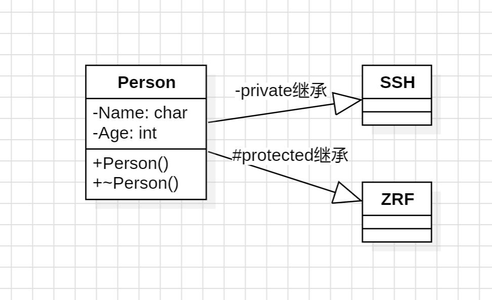

# 2024_11_6

## 4-10

设计一个用于人事管理的“人员”类。由于考虑到通用性，这里只抽象出所有类型人员都具有的属性：编号、性别、出生日期、身份证号等。其中“出生日期”声明为一个“日期”类内嵌子对象。用成员函数实现对人员信息的录入和显示。要求包括：构造函数和析构函数、复制构造函数、内联成员函数、带默认形参值的成员函数、类的组合。  

源码：

```cpp
#include <iostream>
#include <string>
using namespace std;

class Date {
private:
    int year;
    int month;
    int day;
public:
    Date(int y = 0, int m = 0, int d = 0) : year(y), month(m), day(d) {}
    void display() {
        cout << year << "-" << month << "-" << day << endl;
    }
};

class Person {
    
private:
    int id;
    string gender;
    Date birthDate;
    string idCard;
public:
    Person(int i, string g, Date b, string ic="12345") : id(i), gender(g), birthDate(b), idCard(ic) {}
    Person(const Person& p) : id(p.id), gender(p.gender), birthDate(p.birthDate), idCard(p.idCard) {}
    void display() {
        cout << "编号：" << id << endl;
        cout << "性别：" << gender << endl;
        cout << "出生日期：";
        birthDate.display();
    }

    ~Person() {
        cout << "析构函数被调用" << endl;
    }
};

int main() {
    Date d(2000, 1, 1);
    Person p(1, "男", d);
    Person p2(p);
    p.display();
    p2.display();
    return 0;
}
```

运行结果：

```bash
┌──(fqwqf㉿LAPTOP-TQH90R00)-[/mnt/c/Users/fQwQf/Desktop/project/WHU_ALP_2024/experiment4]
└─$ g++ 4-10.cpp

┌──(fqwqf㉿LAPTOP-TQH90R00)-[/mnt/c/Users/fQwQf/Desktop/project/WHU_ALP_2024/experiment4]
└─$ ./a.out
编号：1
性别：男
出生日期：2000-1-1
编号：1
性别：男
出生日期：2000-1-1
析构函数被调用
析构函数被调用
```

## 4-13

定义一个 Circle类，有数据成员 radius(半径),成员函数getArea(),计算圆的面积，构造一个 Circle的对象进行测试。  

源码：

```cpp
#include <iostream>
using namespace std;

class Circle {
private:
    double radius;
public:
    Circle(double r) {
        radius = r;
    }
    double getArea() {
        return 3.14 * radius * radius;
    }
};

int main() {
    Circle c(5.0);
    cout << "面积为: " << c.getArea() << endl;
    return 0;
}
```

运行结果：

```bash
┌──(fqwqf㉿LAPTOP-TQH90R00)-[/mnt/c/Users/fQwQf/Desktop/project/WHU_ALP_2024/experiment4]
└─$ g++ 4-13.cpp

┌──(fqwqf㉿LAPTOP-TQH90R00)-[/mnt/c/Users/fQwQf/Desktop/project/WHU_ALP_2024/experiment4]
└─$ ./a.out
面积为: 78.5
```

## 4-16

据下面C++代码绘出相应的 UML图形表示出类 ZRF、类 SSH和类 Person 之间的继承关系。  

```cpp
class Person{
    public:
    Person(const Persona right);
    ~Person();

    private:
    char Name;
    int Age;
};
class ZRF:protected Person{};
class SSH:private Person{};
```



## 4-19

编写一个名为 CPU的类，描述一个 CPU的以下信息：时钟频率，最大不会超过3000MHz;字长可以是32位或64位；核数可以是单核、双核或四核；是否支持超线
程。各项信息要求使用位域来表示。通过输出 sizeof(CPU)来观察该类所占的字节数。  

源码：

```cpp
#include <iostream>
using namespace std;

class CPU {
public:
    unsigned int frequency : 12; //时钟频率，最大不会超过3000MHz
    unsigned int wordLength : 1; //字长可以是32位或64位
    unsigned int coreNum : 2; //核数可以是单核、双核或四核
    unsigned int hyperThread : 1; //是否支持超线程
};

int main() {
    
    cout << sizeof(CPU) << endl;
    return 0;

}
```

运行结果：

```bash
┌──(fqwqf㉿LAPTOP-TQH90R00)-[/mnt/c/Users/fQwQf/Desktop/project/WHU_ALP_2024/experiment4]
└─$ g++ 4-19.cpp

┌──(fqwqf㉿LAPTOP-TQH90R00)-[/mnt/c/Users/fQwQf/Desktop/project/WHU_ALP_2024/experiment4]
└─$ ./a.out
4
```

## 4-20

定义一个负数类 Complex,使得下面的代码能够工作：  

```cpp
Complex c1(3,5);//用复数 3+5i初始化c1
Complex c2=4.5; //用实数 4.5初始化 c2
cl.add(c2); //将 c1与 c2相加，结果保存在 c1中
c1.show(); //将 c1输出(这时的结果应该是7.5+5i)
```

```cpp
Complex c1(3,5); //用复数3+5i初始化c1
Complex c2=4.5; //用实数4.5初始化c2
c1.add(c2)； //将c1和3c2相加，结果保存在c1中
c1.show(); //将c1输出（这时的结果应该是7.5+5i）
```

源码：

```cpp
#include <iostream>
using namespace std;

class Complex {
private:
    double real;
    double imag;
public:
    Complex(double r = 0, double i = 0) : real(r), imag(i) {}
    
    Complex operator+(const Complex &c) {
        return Complex(real + c.real, imag + c.imag);
    }
    void show() {
        cout << real << "+" << imag << "i" << endl;
    }
    Complex operator=(double d) {
        real = d;
        imag = 0;
        return *this;
    }
    
    void add(const Complex &c) {
        *this = *this + c ;
    }
};

int main(){
    Complex c1(3, 5);
    Complex c2 = 4.5;
    c1.add(c2);
    c1.show();
};
```

运行结果：

```bash
┌──(fqwqf㉿LAPTOP-TQH90R00)-[/mnt/c/Users/fQwQf/Desktop/project/WHU_ALP_2024/experiment4]
└─$ g++ 4-20.cpp

┌──(fqwqf㉿LAPTOP-TQH90R00)-[/mnt/c/Users/fQwQf/Desktop/project/WHU_ALP_2024/experiment4]
└─$ ./a.out
7.5+5i
```
